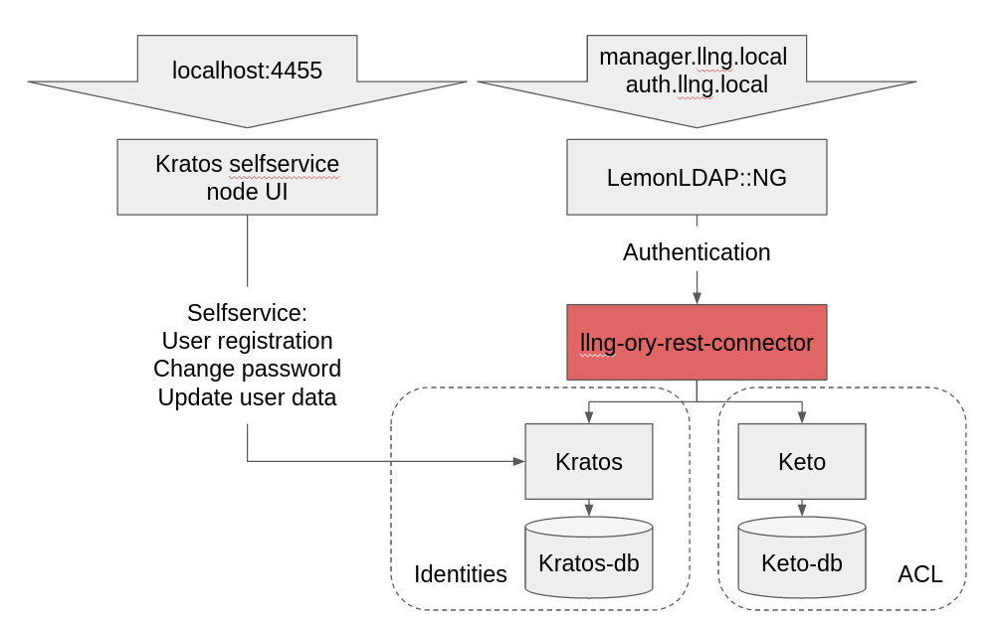

# LLNG Ory REST connector

REST API to connect LemonLDAP::NG (Web SSO) auth backend with Ory Kratos (Cloud native identity infrastructure) & Ory Keto (Permission & role management).



LemonLDAP::NG require authentication backends to authenticate users. One of the available backends is a REST API.

Ory Kratos is an identity provider. This service is able to authenticate user.

Ory Keto is a permission & role provider. This service is able to tell what an identity can do.

## Run

1. Add in your local DNS configuration the hostnames `kratos.local` & `keto.local`:

  ```
  echo "127.0.0.1   kratos.local keto.local manager.llng.local auth.llng.local reload.llng.local" | sudo tee -a /etc/hosts
  ```

2. Run tests scripts (migrate DB, npm install, run containers, provide test data, and finally run tests)
  ```
  ./test.sh
  ```

**LemonLDAP::NG web UI**

1. Go to `http://manager.llng.local`

2. Type credentials from Kratos user:
  * Login: admin@youpi.eu
  * Password: thisIsFake

**User regitration in Kratos**

You can register an user with the selfservice UI deployed with Kratos: http://localhost:4455.

## Endpoints

The application **llng-ory-rest-connector** expose this endpoints:

* `/auth`: authenticate an user with login/password, return the result (true or false) and user infos.
* `/confirm-password`: authenticate an user with login/password, return the result (true or false).

## Links

* LemonLDAP:NG
  * [website](https://lemonldap-ng.org/welcome/)
  * [gitlab](https://gitlab.ow2.org/lemonldap-ng/lemonldap-ng)
* Ory Kratos
  * [github](https://github.com/ory/kratos)
  * [doc](https://www.ory.sh/kratos/docs/)
* Ory Keto
  * [github](https://github.com/ory/keto)
  * [doc](https://www.ory.sh/keto/docs/)
